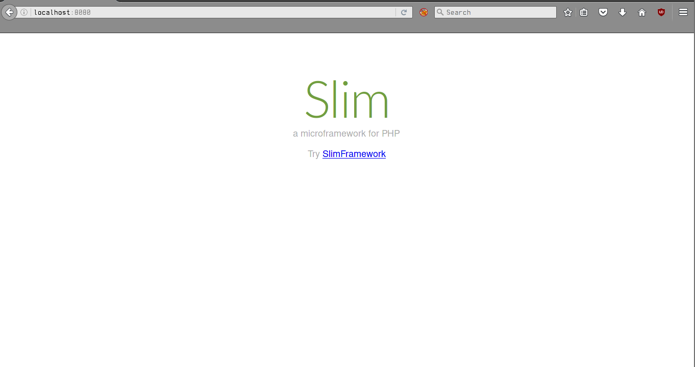
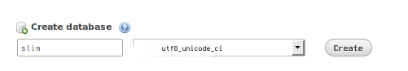

<h3 align="center"></h3>
<h1 align="center">Slim Micro Framework</h1>
<h2 align="center">Manual para hacer CRUD</h2>

### Contenido de este manual
1. [Prerrequisitos](#prerrequisitos)<br>
2. [Instalación](#instalacion)<br>
3. [Creación de Base de datos](#bdd)<br>
3.1. [Método en consola](#consola)<br>
3.2. [Método usando phpmyAdmin](#phpmyadmin)<br>
4. [Configuración de Slim](#config)<br>
5. [Referencias](#referencias)<br>


<section id="prerrequisitos">
### Prerrequisitos para usar Slim

	- PHP 5.5 o posterior
	- Un servidor web con reescritura de URLs 
	- Sistema Manejador de Bases de Datos MariaDB <sup>[1](#foot1)</sup> / MySQL.
</section>

<section id="instalacion">
### Instalación

La manera para instalar Slim recomendada por sus desarrolladores es mediante PHP Composer.

#### Instalación de Composer 

Para instalar Composer escribimos en consola el siguiente comando:

```
	$ curl -sS https://getcomposer.org/installer | sudo php -- --install-dir=/usr/local/bin --filename=composer
```


o si se prefiere, se puede usar el siguiente script<sup>[2](#foot2)</sup>:

```
#!/bin/sh

EXPECTED_SIGNATURE=$(wget https://composer.github.io/installer.sig -O - -q)
php -r "copy('https://getcomposer.org/installer', 'composer-setup.php');"
ACTUAL_SIGNATURE=$(php -r "echo hash_file('SHA384', 'composer-setup.php');")

if [ "$EXPECTED_SIGNATURE" = "$ACTUAL_SIGNATURE" ]
then
    php composer-setup.php --quiet
    RESULT=$?
    rm composer-setup.php
    exit $RESULT
else
    >&2 echo 'ERROR: Invalid installer signature'
    rm composer-setup.php
    exit 1
fi

```
Guardado como `install-composer.sh` para ejecutarlo en terminal con el comando 

```
	$	sh install-composer.sh
```

**Nota**: Mediante este método, podemos mantener actualizado Composer, pero debes mover el archivo composer.phar a la carpeta `/usr/local/bin/` con el comando 

```
	# 	mv composer.phar /usr/local/bin/composer
```
de este modo podrás ejecutar Composer escribiendo solo `composer` en consola en vez de `php <Directorio>composer.phar`.


#### Instalación de Slim

Una buena ventaja de Slim es que proporciona un esqueleto básico sobre el que puedes comenzar a escribir tu aplicación, solo tienes que escribir en consola lo siguiente: 

```
	$ composer create-proyect slim/slim-skeleton crud-slim
```

Esto creará un nuevo directorio `crud-slim`con los archivos necesarios para comenzar a escribir la aplicación.

**Estructura del directorio** 

```
crud-slim
├── composer.json
├── composer.lock
├── CONTRIBUTING.md
├── dirstruct.txt
├── logs
│   ├── app.log
│   └── README.md
├── phpunit.xml
├── public
│   └── index.php
├── README.md
├── src
│   ├── dependencies.php
│   ├── middleware.php
│   ├── routes.php
│   └── settings.php
├── templates
│   └── index.phtml
├── tests
│   └── Functional
│       ├── BaseTestCase.php
│       └── HomepageTest.php
└── vendor/...

```

**Nota:** el directorio `vendor/` contiene muchos subdirectorios pero no es recomendado editar ninguno de los archivos que se contienen aquí ya que aquí está todo lo que composer maneja por nosotros y editarlos causaría daños en el proyecto.

Si ejecutamos `composer start`en el directorio de nuestra aplicación y abrimos nuestro navegador en la dirección `localhost:8080` aparecerá la siguiente vista


</section>

<section id="bdd">
### Creación de Base de datos

<section id="consola">

#### Método en Consola
Creamos una base de datos con el nombre `slim` 

```
$ mysql -u[nombre-de-usuario] -p
> CREATE DATABASE slim;
> \u slim
```

Agregamos la tabla `usuario`.

```
>  CREATE TABLE usuario (`id` BIGINT NOT NULL AUTO_INCREMENT, `nombre` VARCHAR (250) NOT NULL, `correo` VARCHAR (250) NOT NULL, `clave_acceso` VARCHAR (250) NOT NULL, PRIMARY KEY (`id`));
```
</section>

<section id="phpmyadmin">
#### Método con phpMyAdmin

Creamos la base de datos que usaremos para el crud:
	

Creamos la tabla de usuarios:
	
</section>

</section>

<a name="config">
### Configuración de Slim
</a>
Ahora que tenemos la base de datos, hay que agregarla a la configuración de Slim. Para esto, abrimos el archivo `settings.php` que  se encuentra en el directorio `src` y que contiene lo siguiente:

```
<?php
return [
    'settings' => [
        'displayErrorDetails' => true, // set to false in production
        'addContentLengthHeader' => false, // Allow the web server to send the content-length header

        // Renderer settings
        'renderer' => [
            'template_path' => __DIR__ . '/../templates/',
        ],

        // Monolog settings
        'logger' => [
            'name' => 'slim-app',
            'path' => __DIR__ . '/../logs/app.log',
            'level' => \Monolog\Logger::DEBUG,
        ],
    ],
];

```
agregamos después de  `logger` la configuración de nuestra base de datos

```

	//Configuración de base de datos para Slim
	'db' => [
		'host' => 'localhost',
		'user' => '<tu nombre de usuario en mysql>',
		'password' => '<tu contraseña>',
		'dbname' => 'slim'
		'port' => 10862 //el puerto donde esté activo mysql
		],
		
```


### Referencias
> <a name="foot1">1</a>: Mariadbcom. (2016). Mariadbcom. Retrieved 25 September, 2016, from https://mariadb.com/blog/why-should-you-migrate-mysql-mariadb. <br>
> <a name="foot2">2</a>: How to install Composer programmatically?#. (n.d.). Retrieved September 25, 2016, from https://getcomposer.org/doc/faqs/how-to-install-composer-programmatically.md. <br>

